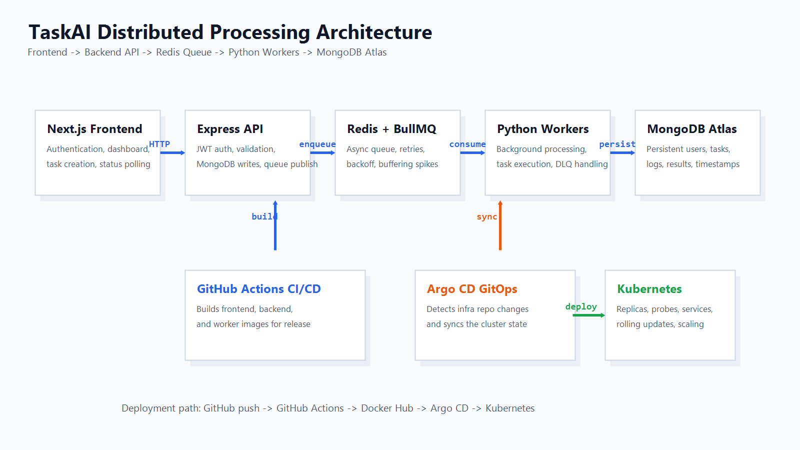
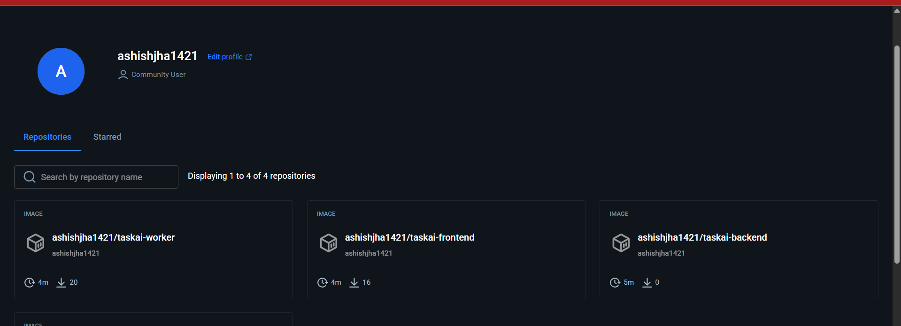
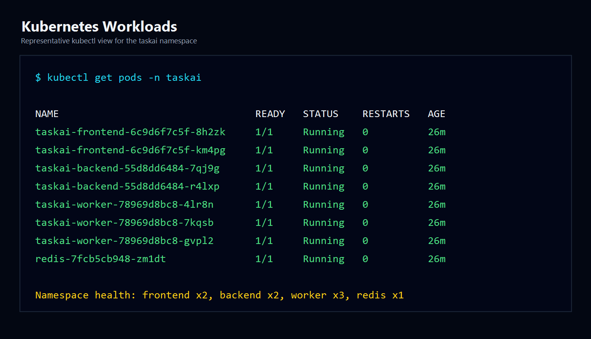
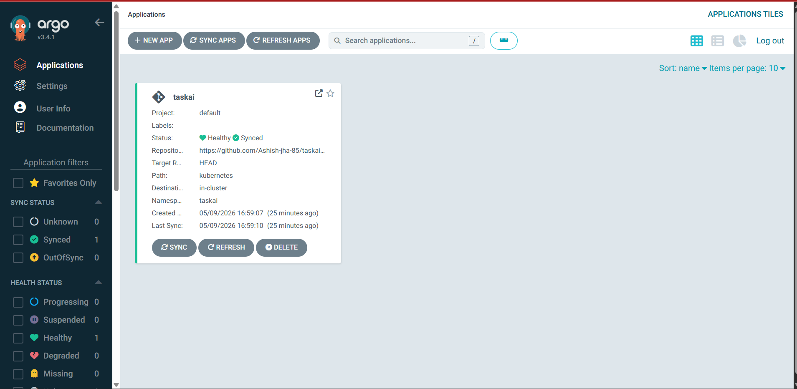
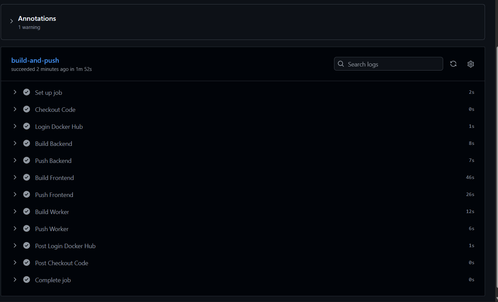
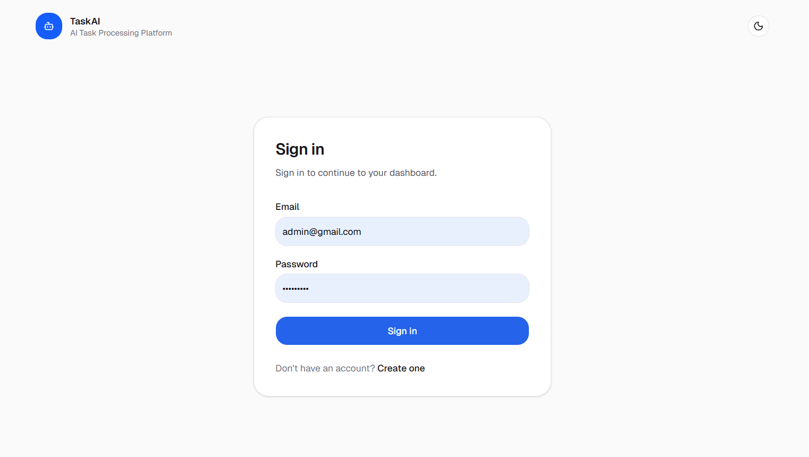
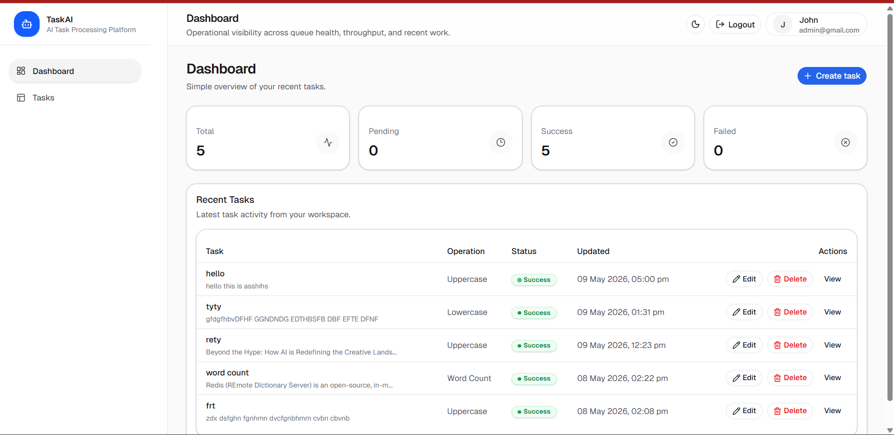
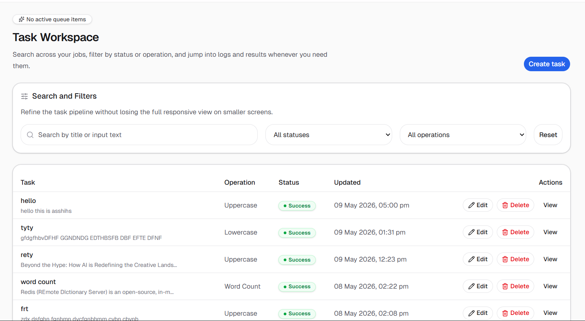

# TaskAI

> Production-style distributed AI task processing platform built for internship submission, portfolio showcase, and open source review.

[](https://nextjs.org/)
[](https://react.dev/)
[](https://nodejs.org/)
[](https://www.python.org/)
[](https://www.mongodb.com/atlas)
[](https://redis.io/)
[](https://www.docker.com/)
[](https://kubernetes.io/)
[](https://argo-cd.readthedocs.io/)
[](https://github.com/features/actions)

TaskAI is a distributed asynchronous task processing platform where users can authenticate, create text-processing jobs, and track execution from a modern dashboard while background workers process tasks independently from the request-response cycle.

## Overview

TaskAI demonstrates a production-oriented architecture using a split processing model:

```text
Frontend (Next.js)
        ->
Backend API (Node.js + Express)
        ->
Redis Queue (BullMQ)
        ->
Python Worker Services
        ->
MongoDB Atlas
```

This separation keeps the API responsive, allows workers to scale independently, and makes the platform suitable for high-throughput asynchronous workloads.

## Features

- JWT-based authentication
- Next.js dashboard for task creation and monitoring
- Supported operations: `uppercase`, `lowercase`, `reverse`, `wordcount`
- Redis + BullMQ queue-backed asynchronous processing
- Python worker service for background execution
- Task status tracking: `pending`, `running`, `success`, `failed`
- Retry logic with exponential backoff
- Dead-letter queue handling for repeatedly failing jobs
- Dockerized local development
- Kubernetes deployment manifests in companion infra repo
- Argo CD GitOps deployment flow
- GitHub Actions image build and push workflow

## System Architecture

### Architecture Diagram



### Core Components

| Component | Technology | Responsibility |
| --- | --- | --- |
| Frontend | Next.js | User interface and task management |
| Backend API | Node.js + Express | Authentication, task APIs, queue producer |
| Queue System | Redis + BullMQ | Asynchronous task distribution |
| Worker Service | Python | Background task processing |
| Database | MongoDB Atlas | Persistent task and user storage |
| Containerization | Docker | Service packaging |
| Orchestration | Kubernetes | Scaling and deployment |
| GitOps | Argo CD | Continuous deployment |
| CI/CD | GitHub Actions | Automated image build and deployment |

## Tech Stack

| Layer | Tools |
| --- | --- |
| Frontend | Next.js 16, React 19, TypeScript, Tailwind CSS, Zustand, React Query |
| Backend | Node.js, Express 5, Mongoose, JWT, bcryptjs, Helmet, express-rate-limit |
| Queueing | Redis, BullMQ, ioredis |
| Worker | Python, redis-py, pymongo, python-dotenv |
| Database | MongoDB Atlas |
| DevOps | Docker, Kubernetes, Argo CD, GitHub Actions, Docker Hub |

## Folder Structure

```text
taskai/
|-- .github/
|   `-- workflows/
|       `-- deploy.yml
|-- assets/
|   |-- architecture.png
|   |-- argocd-dashboard.png
|   |-- dashboard.png
|   |-- docker-containers.png
|   |-- dockerhub-images.png
|   |-- github-actions-success.png
|   |-- kubernetes-pods.png
|   |-- login.png
|   `-- task-processing.png
|-- backend/
|   |-- src/
|   |   |-- config/
|   |   |-- controllers/
|   |   |-- middleware/
|   |   |-- models/
|   |   |-- queue/
|   |   |-- routes/
|   |   |-- services/
|   |   `-- utils/
|   |-- Dockerfile
|   `-- package.json
|-- frontend/
|   |-- src/
|   |   |-- app/
|   |   |-- components/
|   |   |-- lib/
|   |   |-- providers/
|   |   |-- services/
|   |   |-- store/
|   |   `-- types/
|   |-- Dockerfile
|   `-- package.json
|-- worker/
|   |-- worker.py
|   |-- queue_handler.py
|   |-- processor.py
|   |-- db.py
|   |-- redis_client.py
|   |-- requirements.txt
|   `-- Dockerfile
|-- docker-compose.yml
|-- ARCHITECTURE.md
`-- README.md
```

## Task Processing Flow

1. User logs into the platform.
2. User creates a task from the frontend dashboard.
3. Backend validates the request and stores the task in MongoDB with status `pending`.
4. Backend pushes the job into Redis using BullMQ.
5. Python worker consumes the job asynchronously.
6. Worker updates the task to `running`.
7. Worker processes one of the supported operations.
8. Result and logs are stored in MongoDB.
9. Final task status becomes `success` or `failed`.

### Why asynchronous processing matters

- Non-blocking API requests
- Faster frontend response time
- Queue buffering during traffic spikes
- Independent worker scaling
- Retry support for failed jobs

### Current queue defaults

```js
defaultJobOptions: {
  attempts: 3,
  backoff: {
    type: "exponential",
    delay: 2000,
  },
  removeOnComplete: 100,
  removeOnFail: 500,
}
```

## Docker Setup

### Services in `docker-compose.yml`

| Service | Container Name | Port | Purpose |
| --- | --- | --- | --- |
| Frontend | `taskai-frontend` | `3000` | Next.js UI |
| Backend | `taskai-backend` | `5000` | Express API |
| Worker | `taskai-worker` | internal | Async processor |
| Redis | `taskai-redis` | `6379` | Queue broker |

### Start the stack

```bash
docker compose up --build
```

### Local Docker Runtime



### Docker Hub Images


## Kubernetes Deployment

Kubernetes manifests are maintained in the companion infrastructure repository:

- App repo: [Ashish-jha-85/taskai](https://github.com/Ashish-jha-85/taskai)
- Infra repo: [Ashish-jha-85/taskai-infra](https://github.com/Ashish-jha-85/taskai-infra)

### Current deployment shape

| Workload | Replicas | Notes |
| --- | --- | --- |
| Frontend | `2` | Readiness and liveness probes on `/` |
| Backend | `2` | Readiness and liveness probes on `/health` |
| Worker | `3` | Background consumers for Redis queue |
| Redis | `1` | Queue broker |

### Kubernetes Pods



## Argo CD GitOps Workflow

Argo CD watches the infrastructure repository and reconciles cluster state automatically.

```text
GitHub Repo
      ->
Argo CD watches manifests
      ->
Automatic Kubernetes synchronization
      ->
Deployment updates applied
```

### Argo CD Dashboard



## CI/CD Pipeline

GitHub Actions builds and pushes application images on every push to `main`.

```text
Git Push
   ->
GitHub Actions
   ->
Docker Image Build
   ->
Push to Docker Hub
   ->
Argo CD detects changes
   ->
Kubernetes auto-sync
```

### Automated steps

- Docker image build
- Docker Hub authentication
- Container image push
- Deployment automation

### GitHub Actions CI/CD



## Security Features

| Area | Implementation |
| --- | --- |
| Authentication | JWT-based auth for protected API routes |
| Password Security | `bcryptjs` password hashing |
| API Security | Helmet, rate limiting, and validation middleware |
| Secret Management | GitHub Secrets and Kubernetes Secrets |

## Worker Scaling Strategy

### Current strategy

```yaml
replicas: 3
```

### Scaling benefits

- Parallel task execution
- Improved throughput
- Better fault tolerance
- Reduced queue backlog

### Future improvements

- Horizontal Pod Autoscaler
- Queue-length-based scaling
- CPU-based autoscaling

## High Volume Processing Strategy

TaskAI is designed to support high task volume using queue-based decoupling, horizontal worker scaling, Kubernetes orchestration, and MongoDB persistence.

### Current indexing

```js
taskSchema.index({ status: 1 });
taskSchema.index({ userId: 1 });
taskSchema.index({ createdAt: -1 });
```

## Screenshots

### Login Screen



---

### Dashboard



---

### Task Processing



---

### Argo CD Dashboard


---

### GitHub Actions CI/CD


---

### Docker Hub Images


---

### Kubernetes Pods


## API Endpoints

**Base URL**

```text
http://localhost:5000
```

### Authentication

| Method | Endpoint | Description |
| --- | --- | --- |
| POST | `/api/auth/register` | Register a new user and return a JWT |
| POST | `/api/auth/login` | Authenticate a user and return a JWT |

### Tasks

| Method | Endpoint | Description |
| --- | --- | --- |
| POST | `/api/tasks` | Create and enqueue a task |
| GET | `/api/tasks` | Fetch current user's tasks |
| GET | `/api/tasks/:id` | Fetch a single task |
| PUT | `/api/tasks/:id` | Update a completed task and requeue it |
| DELETE | `/api/tasks/:id` | Delete a completed task |

### Health

| Method | Endpoint | Description |
| --- | --- | --- |
| GET | `/health` | Application health check |
| GET | `/redis-health` | Redis connectivity check |

## Environment Variables

### Frontend

| Variable | Purpose |
| --- | --- |
| `NEXT_PUBLIC_API_URL` | Frontend API base URL |

### Backend

| Variable | Purpose |
| --- | --- |
| `PORT` | API port |
| `MONGO_URI` | MongoDB Atlas connection string |
| `JWT_SECRET` | JWT signing secret |
| `JWT_EXPIRES_IN` | Token expiry |
| `REDIS_HOST` | Redis hostname |
| `REDIS_PORT` | Redis port |

### Worker

| Variable | Purpose |
| --- | --- |
| `MONGO_URI` | MongoDB Atlas connection string |
| `REDIS_HOST` | Redis hostname |
| `REDIS_PORT` | Redis port |

## Local Development Setup

### Prerequisites

- Node.js 20+
- npm
- Python 3.x
- Docker Desktop
- MongoDB Atlas connection string

### Run locally

```bash
git clone https://github.com/Ashish-jha-85/taskai.git
cd taskai
docker compose up --build
```

### Local URLs

| Service | URL |
| --- | --- |
| Frontend | `http://localhost:3000` |
| Backend | `http://localhost:5000` |
| Health Check | `http://localhost:5000/health` |

## Future Improvements

- Prometheus and Grafana monitoring
- WebSocket or SSE live updates
- AI-powered task operations
- Distributed tracing
- Centralized logging
- Stronger secret management and token lifecycle controls

## Infrastructure Repository

Recommended structure:

- application code lives in this repository
- Kubernetes manifests and Argo CD configuration live in a dedicated infra repository

Example:

```text
taskai
taskai-infra
```

## Author

**Ashish Jha**

- GitHub: [@Ashish-jha-85](https://github.com/Ashish-jha-85)
- Application Repository: [taskai](https://github.com/Ashish-jha-85/taskai)
- Infrastructure Repository: [taskai-infra](https://github.com/Ashish-jha-85/taskai-infra)

## License

This project is licensed under the MIT License.
